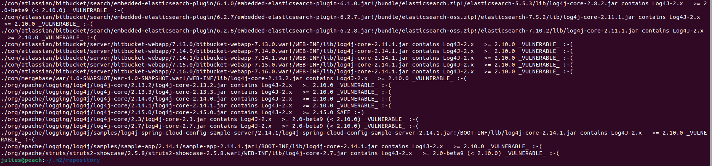

<div style="text-align: right"></div>

# Log4-detector

Detects Log4J versions on your file-system within any application that are vulnerable to [CVE-2021-44228](https://mergebase.com/vulnerability/CVE-2021-44228/)  and [CVE-2021-45046](https://mergebase.com/vulnerability/CVE-2021-45046/). It is able to even find instances that are hidden several layers deep. Works on Linux, Windows, and Mac, and everywhere else Java runs, too!

# Table of Contents
- [Introduction](#itemdetector)
- [Example Usage](#itemexample)
- [More Example Usage](#itemmore)
- [Understanding The Results](#itemresults)
- [Usage](#itemusage)
- [Build From Source ](#itembuild)
- [Testing](#itemtesting)
- [License](#itemlicense)
- [Frequently Asked Questions](#faq)
  - [How Does It Work?](#itemwork)
  - [This Scanner Only Reports Hits Against The `log4j-core` Library. What About `log4j-api`? ](#itemapi)
  - [Why Report About 2.10.0, 2.15.0, and 2.16.0 ? ](#item2.10.0)
  - [What are those "file1.war!/path/to/file2.zip!/path/to/file3.jar!/path/to/log4j.jar" results about? ](#itemwar)
  - [What About Log4J 1.2.x ?](#item1.2.x)
  - [How Can I Be Sure This Isn't A Trojan Pretending To Be A Log4J Detector?](#itemtrojan)
  - [What Is MergeBase All About?](#item)


# Introduction <a name="itemdetector"></a>

Currently reports `log4j-core` versions 2.12.2 and 2.16.0 as **\_SAFE\_**, 2.15.0 as **\_OKAY\_** and all other versions as **\_VULNERABLE\_**
(although it does report pre-2.0-beta9 as "**\_POTENTIALLY_SAFE\_**").

Can correctly detect log4j inside executable spring-boot jars/wars, dependencies blended
into [uber jars](https://mergebase.com/blog/software-composition-analysis-sca-vs-java-uber-jars/), shaded jars, and even
exploded jar files just sitting uncompressed on the file-system (aka *.class).

We currently maintain a collection of [log4j-samples](https://github.com/mergebase/log4j-samples) we use for testing.

# Example Usage: <a name="itemexample"></a>

java -jar log4j-detector-2021.12.16.jar [path-to-scan] > hits.txt



# More Example Usage: <a name="itemmore"></a>

```
java -jar log4j-detector-2021.12.16.jar ./samples 

-- github.com/mergebase/log4j-detector v2021.12.16 (by mergebase.com) analyzing paths (could take a while).
-- Note: specify the '--verbose' flag to have every file examined printed to STDERR.
/opt/mergebase/log4j-detector/samples/clt-1.0-SNAPSHOT.jar contains Log4J-2.x   >= 2.10.0 _VULNERABLE_ :-(
/opt/mergebase/log4j-detector/samples/infinispan-embedded-query-8.2.12.Final.jar contains Log4J-2.x   >= 2.0-beta9 (< 2.10.0) _VULNERABLE_ :-(
/opt/mergebase/log4j-detector/samples/log4j-1.1.3.jar contains Log4J-1.x   <= 1.2.17 _OLD_ :-|
/opt/mergebase/log4j-detector/samples/log4j-1.2.13.jar contains Log4J-1.x   <= 1.2.17 _OLD_ :-|
/opt/mergebase/log4j-detector/samples/log4j-1.2.17.jar contains Log4J-1.x   <= 1.2.17 _OLD_ :-|
/opt/mergebase/log4j-detector/samples/log4j-core-2.0-beta2.jar contains Log4J-2.x   <= 2.0-beta8 _POTENTIALLY_SAFE_ :-| (or did you already remove JndiLookup.class?) 
/opt/mergebase/log4j-detector/samples/log4j-core-2.0-beta9.jar contains Log4J-2.x   >= 2.0-beta9 (< 2.10.0) _VULNERABLE_ :-(
/opt/mergebase/log4j-detector/samples/log4j-core-2.0.2.jar contains Log4J-2.x   >= 2.0-beta9 (< 2.10.0) _VULNERABLE_ :-(
/opt/mergebase/log4j-detector/samples/log4j-core-2.0.jar contains Log4J-2.x   >= 2.0-beta9 (< 2.10.0) _VULNERABLE_ :-(
/opt/mergebase/log4j-detector/samples/log4j-core-2.10.0.jar contains Log4J-2.x   >= 2.10.0 _VULNERABLE_ :-(
/opt/mergebase/log4j-detector/samples/log4j-core-2.12.2.jar contains Log4J-2.x   >= 2.12.2 _SAFE_ :-)
/opt/mergebase/log4j-detector/samples/log4j-core-2.14.1.jar contains Log4J-2.x   >= 2.10.0 _VULNERABLE_ :-(
/opt/mergebase/log4j-detector/samples/log4j-core-2.15.0.jar contains Log4J-2.x   >= 2.15.0 _OKAY_ :-|
/opt/mergebase/log4j-detector/samples/log4j-core-2.16.0.jar contains Log4J-2.x   >= 2.16.0 _SAFE_ :-)
/opt/mergebase/log4j-detector/samples/log4j-core-2.4.1.jar contains Log4J-2.x   >= 2.0-beta9 (< 2.10.0) _VULNERABLE_ :-(
/opt/mergebase/log4j-detector/samples/log4j-core-2.9.1.jar contains Log4J-2.x   >= 2.0-beta9 (< 2.10.0) _VULNERABLE_ :-(
```

# Understanding The Results <a name="itemresults"></a>

**\_VULNERABLE\_** -> You need to upgrade or remove this file.

**\_OKAY\_** -> We only report this for Log4J version 2.15.0. We recommend upgrading to 2.16.0.

**\_SAFE\_** -> We currently only report this for Log4J versions 2.16.0 and 2.12.2.

**\_OLD\_** -> You are safe from CVE-2021-44228, but should plan to upgrade because Log4J 1.2.x has been EOL for 10 years and has several known-vulnerabilities.

**\_POTENTIALLY_SAFE\_** -> The "JndiLookup.class" file is not present, either because your version of Log4J is very old (pre 2.0-beta9), or because someone already removed this file. Make sure it was someone in your team or company that removed "JndiLookup.class" if that's the case, because attackers have been known to remove this file themselves to prevent additional competing attackers from gaining access to compromised systems.

# Usage <a name="itemusage"></a>

```
java -jar log4j-detector-2021.12.16.jar 

Usage: java -jar log4j-detector-2021.12.16.jar [--verbose] [paths to scan...]

Exit codes:  0 = No vulnerable Log4J versions found.
             1 = At least one legacy Log4J 1.x version found.
             2 = At least one vulnerable Log4J version found.

About - MergeBase log4j detector (version 2021.12.16)
Docs  - https://github.com/mergebase/log4j-detector 
(C) Copyright 2021 Mergebase Software Inc. Licensed to you via GPLv3.
```

# Build From Source: <a name="itembuild"></a>

```
git clone https://github.com/mergebase/log4j-detector.git
cd log4j-detector/
mvn install
java -jar target/log4j-detector-2021.12.16.jar
```
# Testing: <a name="itemtesting"></a>

We maintain a collection of log4j samples here:  https://github.com/mergebase/log4j-samples

# License <a name="itemlicense"></a>

GPL version 3.0

# How Does It Work? <a name="itemwork"></a>

The Java compiler stores String literals directly in the compiled *.class files. If log4j-detector detects a file
named "JndiManager.class"
on your file-system, it then examines that file for this String: "Invalid JNDI URI - {}". Turns out that specific String
literal is only present in the patched version of Log4J (version 2.15.0). Any versions of Log4J without that String are
vulnerable.

# Frequently Asked Questions <a name="faq"></a>

## This Scanner Only Reports Hits Against The `log4j-core` Library. What About `log4j-api`? <a name="itemapi"></a>

Many scanners (including GitHub's own [Dependabot](https://github.com/dependabot)) currently report both "`log4j-core`" and "`log4j-api`" libraries as vulnerable.  These scanners are incorrect. There is currently no existing version of the "`log4j-api`" library that can be exploited by any of these vulnerabilities.

At MergeBase we pride ourselves on our scan accuracy. You're already busy enough patching and defending your systems. We don't want you to waste your time with false positives. That's why we don't report any hits against `log4j-api`.


## Why Report About 2.10.0, 2.15.0, and 2.16.0 ? <a name="item2.10.0"></a>

We consider version 2.10.0 important because that's the first version where Log4J's vulnerable "message lookup feature" can be disabled via Log4J configuration.

We consider version 2.15.0 important because that's the first version where Log4J's default out-of-the-box configuration is not vulnerable to CVE-2021-44228.

And version 2.16.0 is important because it's not vulnerable to CVE-2021-45046. Despite CVE-2021-45046 being much less serious,
we anticipate everyone will want to patch to 2.16.0.

## What are those "file1.war!/path/to/file2.zip!/path/to/file3.jar!/path/to/log4j.jar" results about? <a name="itemwar"></a>

The "!" means the log4j-detector entered a zip archive (e.g., *.zip, *.ear, *.war, *.aar, *.jar). Since zip files can
contain zip files, a single result might contain more than one "!" indicator in its result.

Note:  the log4j-detector only recursively enters zip archives. It does not enter tar or gz or bz2, etc. The main reason
being that Java systems are often configured to execute jars inside jars, but they are never configured to execute other
file formats (that I know of!). And so a log4j copy inside a *.tar.gz is probably not reachable for a running Java
system, and hence, not a vulnerability worth reporting.

2nd note:  for zips-inside-zips our scanner does load the inner-zip completely into memory (using ByteArrayInputStream)
before attempting to scan it. You might need to give Java some extra memory if you have extremely large inner-zips on
your system (e.g., 1 GB or larger).

# What About Log4J 1.2.x ? <a name="item1.2.x"></a>

Only versions of Log4J 2.x (from 2.0-beta9 to 2.14.1) are vulnerable to CVE-2021-44228.

# How Can I Be Sure This Isn't A Trojan Pretending To Be A Log4J Detector? <a name="itemtrojan"></a>

Great question! Since we include the complete source code here in Github (all 750 lines of Java), as well as the steps
to build it, and since this tool has zero dependencies, it shouldn't take too long to carefully study the code to your
satisfaction. If you don't trust Maven you can go directly into the "src/main/java/com/mergebase/log4j" directory and
type "javac \*.java". That works, too!

# What Is MergeBase All About? <a name="itemmergebase"></a>


[MergeBase](https://mergebase.com/) is an SCA company (Software Composition Analysis) based in Vancouver, Canada. We're
similar to companies like Snyk, Sonatype, Blackduck, etc., in that we help companies detect and manage vulnerable
open-source libraries in their software. Check us out! We have great accuracy, great language support, and we're not too
expensive, either: [mergebase.com/pricing](https://mergebase.com/pricing/).

We would be delighted if anyone takes a [2-week free trial](https://mergebase.com/try/) of our SCA product! And if you email our CEO (oscar@mergebase.com) with the subject "log4j-detector" we will extend your free trial to 4-weeks.


